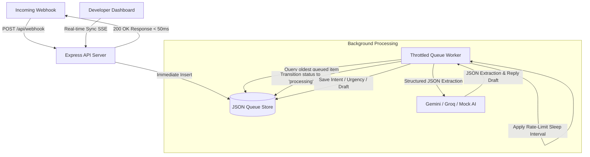

# ⚡ Throttled Bulk Messaging Auto-Responder Queue

A production-ready architecture designed to survive API rate limits (`429 Too Many Requests`) during high-traffic business message campaigns. It decouples incoming message webhooks from AI inference processing using a persistent local task queue and a rate-limited background worker engine.

Includes a real-time, dark-mode developer dashboard built with glassmorphism aesthetics.

---

## 🏗️ Architecture Blueprint

Standard conversational chatbots process messages synchronously. However, when a business launches a messaging campaign (via WhatsApp, SMS, or Telegram) and receives hundreds of customer replies within minutes, a synchronous AI call will immediately crash under developer rate limits (e.g. 15 RPM for Gemini, 30 RPM for Groq). 

This pipeline resolves this problem by separating ingestion from processing:



1. **Ingest to a Message Queue (Immediate Execution)**: When a customer reply hits `/api/webhook`, the server logs the payload into the database, updates the SSE stream, and returns a `200 OK` response to the provider in under **50ms**.
2. **Throttled Background Worker (Rate-Limited Execution)**: A background worker pulls messages one-by-one. It enforces a strict rate limit (e.g., maximum 20 RPM) by sleeping for the remaining duration of the interval (`60000 / RPM`) before starting the next job. This prevents overlapping threads and concurrency limit blocks.
3. **Structured JSON Processing**: The worker asks the AI model to return a structured JSON response identifying the customer's intent, urgency level, detected language, and any extracted entities (order IDs, booking dates) alongside a draft response.
4. **Final Action Dispatch**: The application reads the finalized JSON entry to route the message (e.g., automatically dispatching answers for FAQs, or flagging high-urgency/complaints for human escalation).

---

## ✨ Features

- **Blazing Fast Ingestion**: Accepts webhook spikes immediately to prevent timeouts from messaging gateways.
- **Throttled Engine**: Adjust RPM limits in real-time. The worker dynamically recalculates sleep intervals.
- **Structured Schema Extraction**: Guarantees replies fit the strict extraction schema:
  ```json
  {
    "customer_intent": "order_inquiry | booking_request | complaint | general_faq | human_escalation",
    "urgency_score": "low | medium | high",
    "detected_language": "en",
    "extracted_entities": {
      "order_id": "string or null",
      "requested_date": "string or null"
    },
    "draft_response": "Suggested reply..."
  }
  ```
- **Real-Time Developer Dashboard**: Built with modern CSS glassmorphism, dynamic metrics cards (backlog count, completed logs, failed tasks, live RPM tracking), and visual progress bars mapping active throttling countdowns.
- **Supported Providers**: Google Gemini 2.5 Flash, Groq (Llama 3.1 8B Instant), and a rule-based mock simulator (allowing complete offline testing).

---

## 🚀 Getting Started

### 1. Prerequisites
- [Node.js](https://nodejs.org/) (v18 or higher recommended)

### 2. Installation
```bash
git clone https://github.com/yohantse/bulk-message-responder.git
cd bulk-message-responder
npm install
```

### 3. Start the Server
```bash
npm start
```
The server will initialize `queue_db.json` and start listening on `http://localhost:3000`.

### 4. Open the Dashboard
Open your browser and navigate to:
👉 **[http://localhost:3000](http://localhost:3000)**

---

## 🧪 Simulation & Load Testing

### Webhook Burst Load Test
We included a burst simulator script to test the concurrent payload ingest and queue depletion mechanics.

While the server is running, execute:
```bash
node test_ingest.js
```

This script fires **100 concurrent HTTP requests** in a tight loop. You will see:
- The script finishes in under **800ms**, successfully queueing all 100 entries.
- If you watch your browser dashboard at `localhost:3000`, the **Queue Backlog** will immediately jump to 100, and the worker status will change to **Active** / **Throttled**.
- The worker will process the backlog one-by-one, maintaining your configured RPM limit (e.g., at 20 RPM, it takes exactly 3 seconds between requests).
